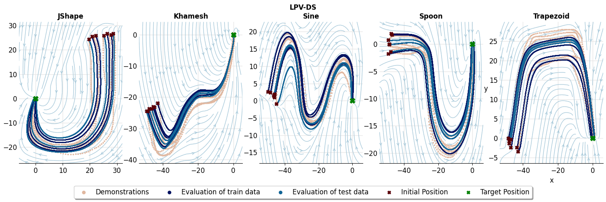

# Experiment 1
Lasa Learning from Demonstration
**To be updated - placeholder**

# Folder and file description
```
├── data # data folder containing the datasets, and the lasa + ds-opt results
├── models # trained models for results used in paper
├── plots # plots used in paper .svg and pdf
└── scripts
    ├── errors_plot.py #  errors bar plot for all the methods
    ├── eval_big.py # evaluate trained model (store result to .npz to be plotted later)
    ├── generate_datasets.py # generate dataset splits
    ├── train_big.py # large script that is used for training
    └── utils.py  # helper functions

```

# data
In order to populate the data folder run the script named "generate_datasets.py" also download the SEDS data from this [link]()


# Results
## ANDPS

## Simple NN


## LPV-DS
